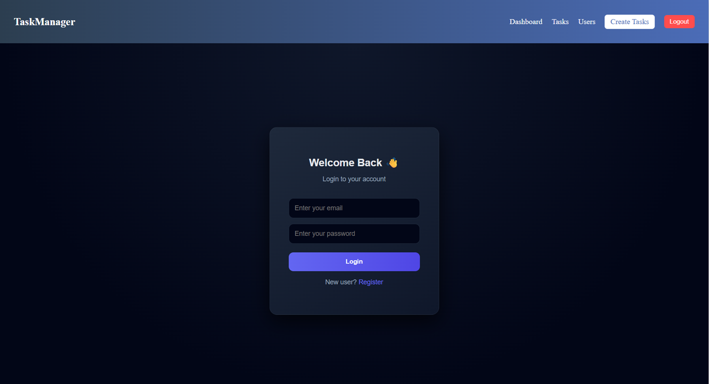
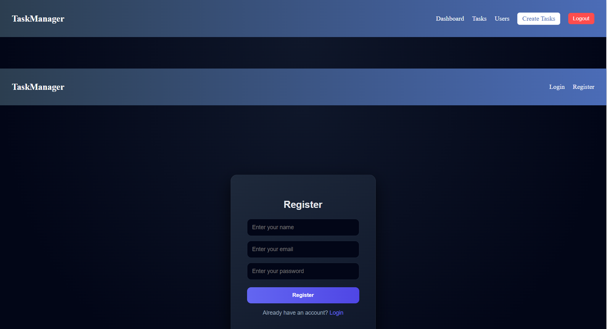
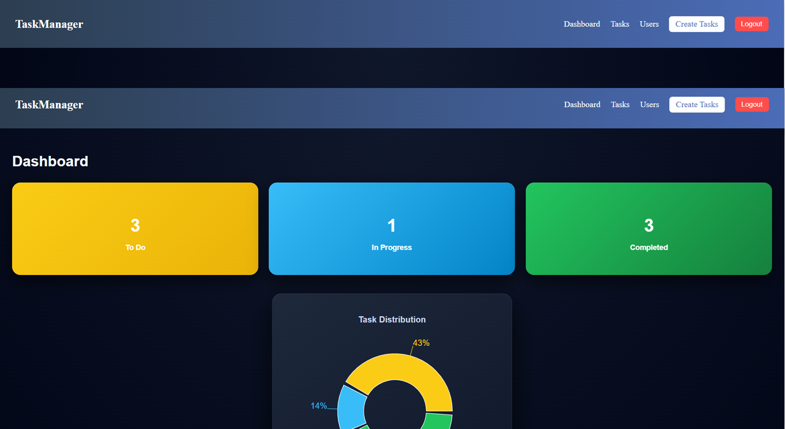
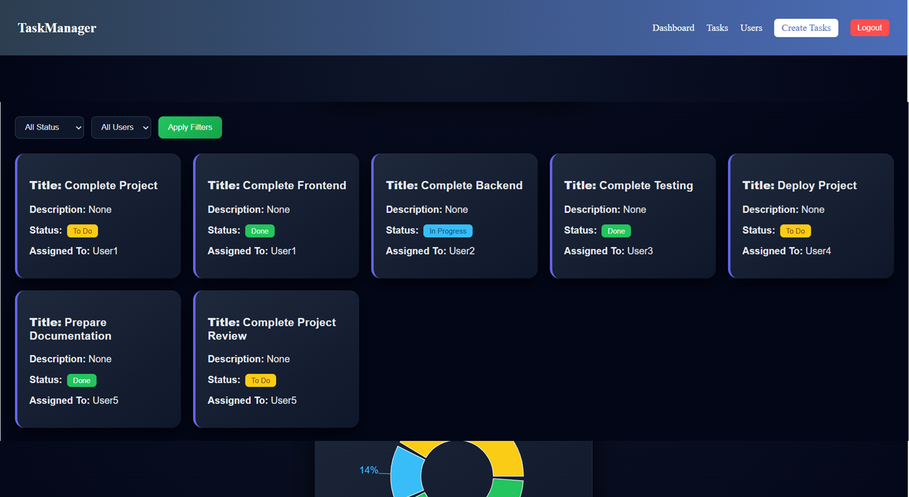
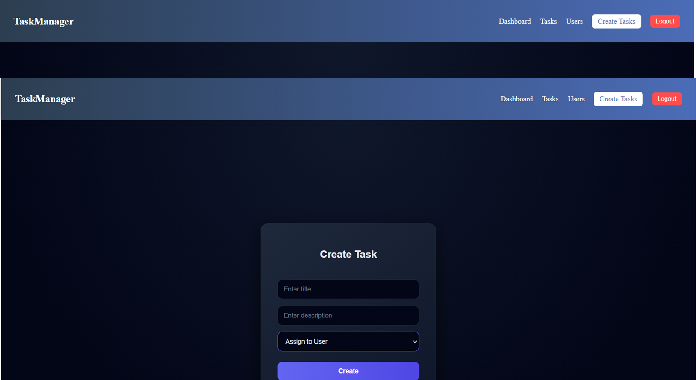
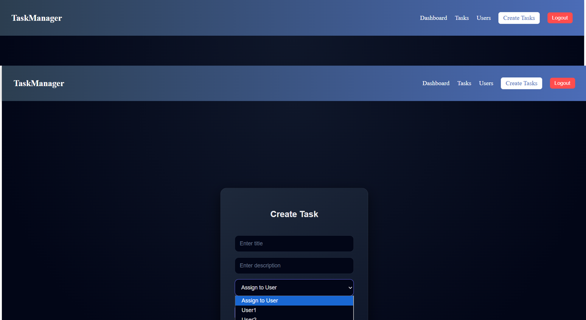
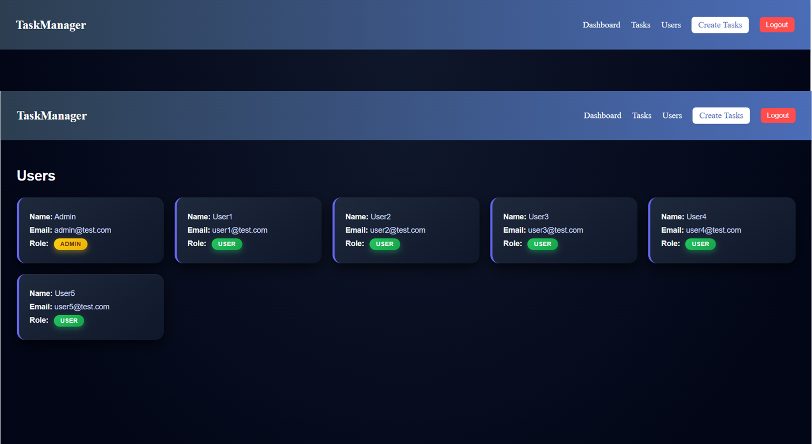
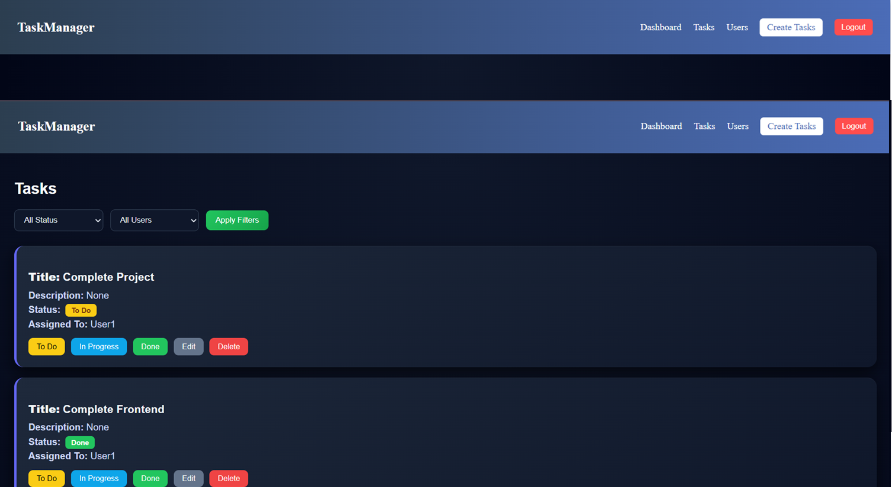
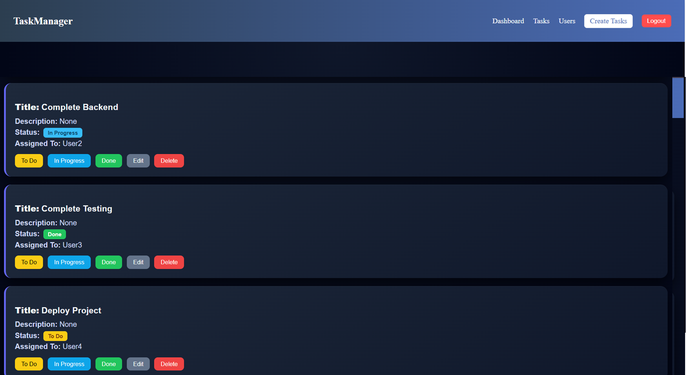

# Task Management System (Capstone Project)

## Overview

This project is a full-stack Task Management System developed using React, Spring Boot, MySQL, Docker, and GitHub Actions. It allows users to create, assign, and track tasks efficiently.

---

## Problem Statement

Small teams often lack a centralized system to manage tasks, leading to:

* Poor visibility of task progress
* Lack of ownership
* Difficulty in tracking updates

This application provides a structured solution for task management.

---

## Technology Stack

Frontend:
React (Vite)

Backend:
Spring Boot, REST API, JPA/Hibernate

Database:
MySQL 8

DevOps:
Docker, Docker Compose

CI/CD:
GitHub Actions

---

## User Roles

Admin:

* Create users
* View all users
* Create tasks
* Assign tasks to users
* View all tasks

User:

* View assigned tasks
* Update task status

Important Note:

When the application is run for the first time, the database is empty. Therefore, you must first register a user who will become the Admin. The first registered user is assigned the Admin role automatically.

All users registered after that will have the User role.

If no tasks are created by the Admin, the dashboard will remain empty. Therefore, after creating the Admin and some users, log in as Admin and assign tasks to users to properly view the dashboard.

Only the Admin can assign tasks to users.

## Sample Users

Admin:
Email: [admin@test.com]
Password: 123456

User1:
Email: [user1@test.com]
Password: 123456

User2:
Email: [user2@test.com]
Password: 123456

## Authentication

* Secure login implemented
* Passwords are stored in hashed format
* Role-based access control (ADMIN and USER)

---

## Features

User Management:

* Login functionality
* View users (Admin only)

Task Management:

* Create tasks (Admin only)
* Assign tasks to users
* Update task status
* Delete tasks 

Dashboard:

* View tasks
* Filter tasks by status and assigned user
* Display task information clearly

---

## Database Design

Users Table:

* id (Primary Key)
* name
* email (unique)
* password_hash
* role (ADMIN or USER)
* created_at

Tasks Table:

* id (Primary Key)
* title
* description
* status (TODO, IN_PROGRESS, DONE)
* assigned_to (Foreign Key -> users.id)
* created_by (Foreign Key  -> users.id)
* created_at
* updated_at

---

## API Endpoints

Authentication:
POST /api/auth/login

Users:
GET /api/users

Tasks:
POST /api/tasks
GET /api/tasks
GET /api/tasks/{id}
PUT /api/tasks/{id}
DELETE /api/tasks/{id}

---

## Frontend Pages

* Login Page 
* Dashboard
* Create/Edit Task Page
* User Management Page (Admin)

---

## Application Flow

1. Application starts with an empty database
2. Admin user must be created by registering first 
3. Admin logs into the system
4. Admin creates tasks and assigns them
5. Users log in and update task status
6. Dashboard displays updated task information

---

## Docker Setup

To run the complete application using Docker:

docker-compose up --build

Access URLs:
Frontend: http://localhost:4173
Backend: http://localhost:8080

---

## Running Locally

Backend:
mvn spring-boot:run

Frontend:
npm install
npm run dev

Frontend URL:
http://localhost:5173

---

## Project Screenshots

### Login Page

### Register Page

### Dashboard

### Create Task

### Users List

### Tasks

---

## CI/CD

GitHub Actions is used for continuous integration:

* Builds backend using Maven
* Builds frontend using Node
* Builds Docker images

---

## Deliverables

* Full source code
* Docker configuration
* CI/CD pipeline
* Documentation

---

## Author

Swayam Sunilkumar Singh
